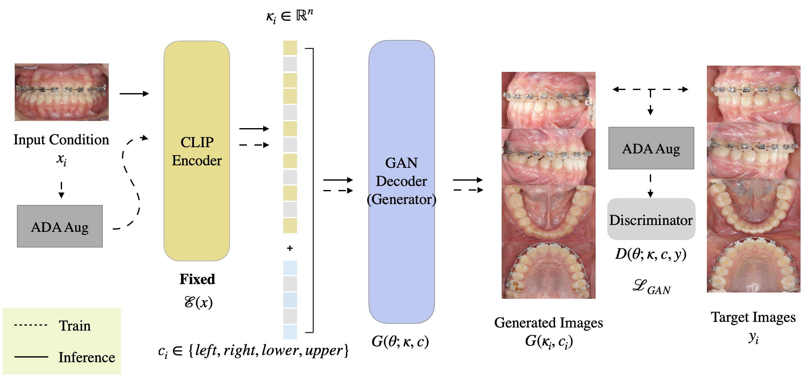
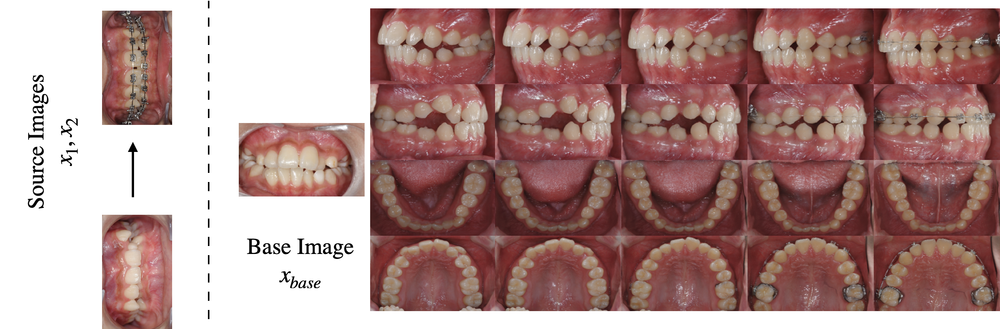
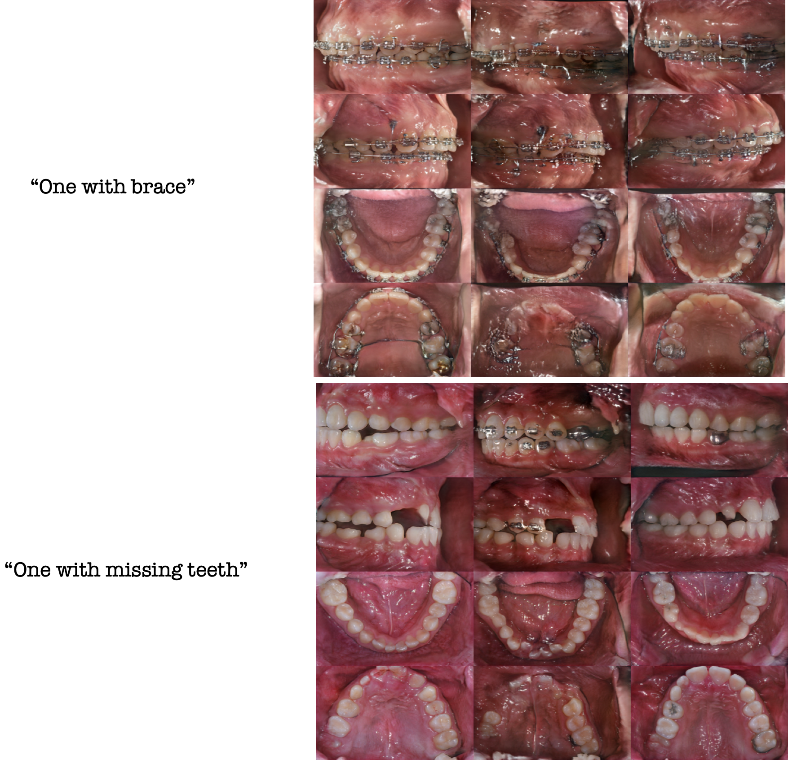
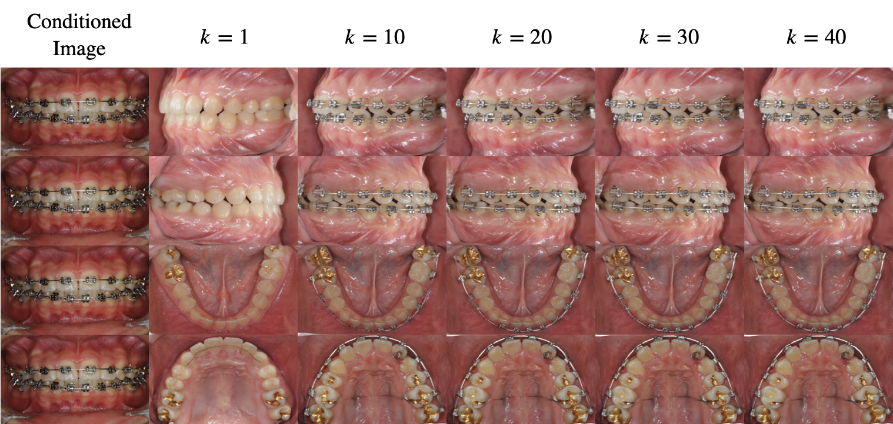

## MICCAI2023 Workshop] Official Pytorch Implementation of CLIP-IVP

This is an official implementation of CLIP-IVP: CLIP-based Intraoral View Prediction presented in MICCAI2023 1st MedAGI workshop. 
We exploited the source codes in stylegan2-ada repository for our implementation.

In this study, we propose a novel method called CLIP-based Intraoral View Prediction (CLIP-IVP) for predicting novel views of intraoral structure using only a single front teeth image of a patient. This
task has not been explored in previous medical imaging applications.

Our approach leverages pre-trained CLIP image encoder to represent
front intraoral images, reducing time and resources for training. Our
model achieves a Frechet Inception Distance (FID) score of 3.4 on the intraoral
view prediction task, suggesting the effectiveness of our method.
Furthermore, we demonstrate that our model can be used to predict
the orthodontic treatment process in a one-shot manner, which might
be useful in treatment planning and prediction. Overall, our proposed
model provides a new framework for generating high-fidelity medical
images and opens up possibilities for future research in this field. Our
work has the potential to provide more accurate predictions only using
a small amount of data, and to support clinicians for better treatment
planning. Additionally, our approach can be adapted for use in other domains.

### Network Diagram

This figure illustrates the training and inference processes for CLIP-IVP. We freeze pretrained CLIP image encoder during both training and inference phases. 

### Semantic-Nudge

An example of one-shot semantic nudge using a pair of source images. We
manipulate the base image to reflect the semantic difference between a pair of
source images, such as pre- and post-treatment intraoral images. With semantic
nudge, we can progressively predict the orthodontic treatment process of a
patient. The predicted images show the process of leveling and alignment.

### Text-To-Image 

We tested the zero-shot text-to-image generation ability of our model. For this task, we simply substituted the CLIP image encoder with the CLIP text encoder at the inference phase, without any further training. Since our model doesn’t learn the direct CLIP text embeddings, this method cannot guarantee the results. Nevertheless, it gives us a chance to explore pre- trained CLIP latent space when medical phraseologies are projected onto it.

### Direction-Dependency of CLIP Embeddings

Since CLIP latent is unit normalized during CLIP training, we hypothesize that information is encoded into the direction of the latent code and the norm of the latent would have trivial impact. We simply test our assumption by progressively multiplying a constant to unit-normalized CLIP embeddings and decoding this intermediate latent. From the above figure, we can observe our conjecture agrees with the results.
